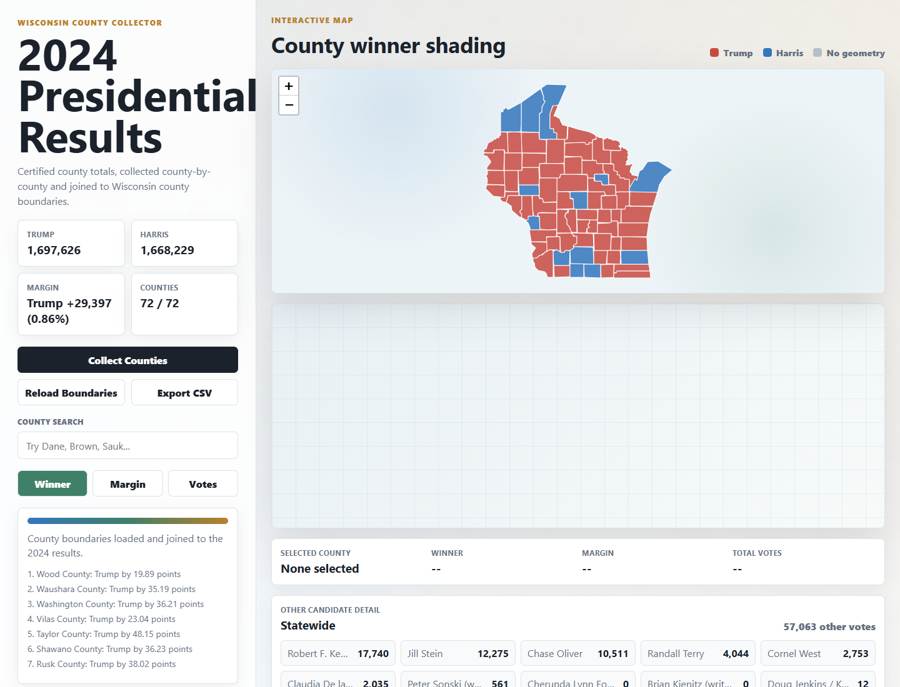

# Wisconsin 2024 Election County Mapper

A static web app that collects Wisconsin's 72 county-level 2024 presidential
results and maps them against Wisconsin county boundaries. It includes the full
certified candidate/write-in breakdown behind each county's "Other" total.



## How To Run

Open `index.html` in a browser. The app is static and does not need a build
step or a local server.

The map uses Leaflet and local Wisconsin county boundaries in
`data/wi-counties.geojson`. If Leaflet is blocked, the app falls back to an
interactive county tile grid using the same result data.

For GitHub Pages, publish the repository root from the `main` branch.

## Verify The Data

Run these from the repo root:

```powershell
python scripts/build-data.py
python scripts/validate-data.py
```

Or, if you use npm:

```powershell
npm.cmd run build:data
npm.cmd run validate
```

Use `npm.cmd` in PowerShell if Windows blocks `npm.ps1`.

To import a turnout CSV:

```powershell
python scripts/import-turnout.py data/your-turnout-file.csv
```

Use `data/turnout-template.csv` as a format example. The template is not loaded
as real app data.

## Data Notes

Wisconsin does not publish unofficial election-night results from one statewide
reporting website; MyVote says those are posted by county clerks. For a stable
2024 map, this app uses the certified county result table sourced to the
Wisconsin Elections Commission's `County by County Report_POTUS`.

The official WEC PDF is saved locally as `data/County by County Report_POTUS.pdf`.

## ETA-Style Test Panel

The app includes a status panel based on the Election Truth Alliance's published
methodology categories: down-ballot difference, vote-share-by-vote-count, and
turnout analysis.

The down-ballot and vote-share checks are run from the WEC ward-level federal
and state contest spreadsheet using the President and U.S. Senate reports. The
turnout analysis still requires registered-voter or eligible-voter denominators,
preferably by ward/precinct. The WEC ward results spreadsheet used here does not
include those denominator fields, so the panel reports turnout as `Needs data`
instead of treating it as pass/fail.

The low-cost turnout path is to collect county or municipal ward-by-ward canvass
reports. Some local reports publish registered-voter counts from before Election
Day. Because Wisconsin permits Election Day registration, those denominators can
be lower than the final registered-voter count and can produce apparent turnout
above 100%. The app requires any imported turnout row to track the timing of the
registration denominator and displays a warning whenever pre-Election-Day
registration counts are used.

The app also renders ETA-style graph types:

- Vote-share-by-vote-count scatterplot with ward-level Trump/Harris points and
  trend lines.
- Down-ballot difference histogram comparing presidential votes with U.S. Senate
  votes by party.
- Turnout histogram placeholder that remains warning-gated until registration
  denominator data is imported.

Selecting a county from the map or table filters the ETA-style graphs to that
county's ward rows; no selection shows the statewide ward dataset.

See `docs/methodology.md` for interpretation notes and limitations.

Downloaded verification files:

- `data/County by County Report_POTUS.pdf`
- `data/County by County Report_US Senate.pdf`
- `data/Ward by Ward Report Federal and State Contests.xlsx`
- `data/wi-counties.geojson`

## Complete Source Inventory

Every source currently used by the app:

- Presidential county results: WEC `data/County by County Report_POTUS.pdf`.
  Powers map shading, county table, statewide totals, candidate breakdown, CSV
  export, and selected-county details.
- U.S. Senate county results: WEC `data/County by County Report_US Senate.pdf`.
  Used as county-level verification context for the down-ballot comparison.
- Ward federal/state results: WEC `data/Ward by Ward Report Federal and State
  Contests.xlsx`, converted into `data/eta-data.js`.
  Powers ETA-style ward scatterplots, down-ballot histograms, and selected-county
  graph filtering.
- County boundaries: U.S. Census TIGERweb State/County layer.
  Powers the county polygon map.
- ETA methodology: Election Truth Alliance methodology page.
  Used for analysis categories and graph-type choices.
- Wisconsin result-reporting context: Wisconsin MyVote election results note.
  Used to explain county-posted election-night results and certified WEC source
  preference.
- Turnout denominator warning: Wisconsin registration-deadline information plus
  Votebeat's Oak Creek turnout explainer.
  Used to warn about pre-Election-Day registration denominators.
- Voter-file cost context: Badger Voters FAQ and Wis. Admin. Code EL 3.50.
  Used only to evaluate and reject the statewide voter-file option as too costly
  for this project.

Links:

- Wisconsin MyVote election result reporting note:
  <https://myvote.wi.gov/en-us/Election-Results>
- 2024 Wisconsin presidential county table:
  <https://en.wikipedia.org/wiki/2024_United_States_presidential_election_in_Wisconsin#By_county>
- U.S. Census TIGERweb State/County service:
  <https://tigerweb.geo.census.gov/arcgis/rest/services/TIGERweb/State_County/MapServer>
- Election Truth Alliance methodology:
  <https://electiontruthalliance.org/our-methodology/>
