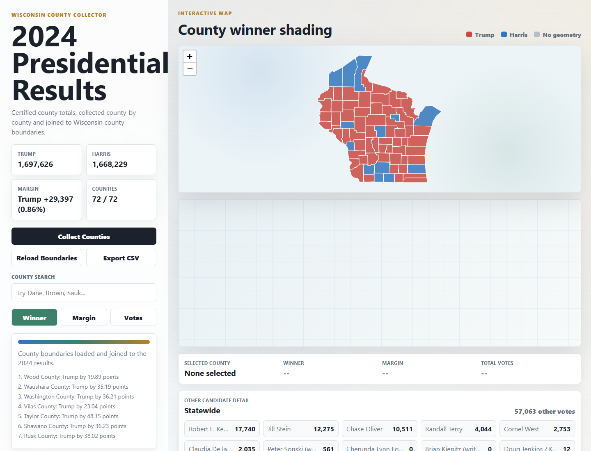

# Multi-State Presidential Results Explorer

https://camreyn.github.io/wisconsin-2024-election-mapper/

A static web app for reviewing certified 2024 presidential results by state,
tracking source provenance, and comparing presidential baselines where
state-specific source rows are loaded. Coverage varies by state: some states
have maps only, some add turnout or historical baselines, and states with
same-grain comparison rows can show review graphs.



## How To Run

Open `index.html` in a browser. The app is static and does not need a build
step or a local server.

The map uses Leaflet and local state county boundaries in generated state
geometry bundles. If Leaflet is blocked, the app falls back to an interactive
county tile grid using the same result data.

For GitHub Pages, publish the repository root from the `main` branch.

## Verify The Data

Run these from the repo root:

```powershell
python scripts/build-data.py
python scripts/validate-data.py
```

Or, if you use npm:

```powershell
npm.cmd run build:data
npm.cmd run build:states
npm.cmd run build:minnesota
npm.cmd run build:history
npm.cmd run validate
npm.cmd run validate:history
npm.cmd run validate:state-config
npm.cmd run validate:source-pipeline
npm.cmd run validate:ui
```

Use `npm.cmd` in PowerShell if Windows blocks `npm.ps1`.

To download any missing configured state source files before rebuilding:

```powershell
npm.cmd run build:states:download
```

To import a turnout CSV:

```powershell
py scripts/import-turnout.py data/your-turnout-file.csv
```

Use `data/turnout-template.csv` as a format example. You can pass more than one
CSV to combine verified sources. The template is not loaded as real app data.

## Data Notes

The app is organized around official state election authority files, official
public results portals, local election office reports, and clearly documented
derived source rows. Each state config records which files are used for county
maps, review graphs, turnout rows, historical baselines, and source-planner
coverage.

## Multi-State Readiness

The app has a generated state registry at `data/state-registry.js`. State
coverage is promoted incrementally as official sources and parsers are mapped.
Minnesota is a full expanded state with certified 2024 presidential county
totals aggregated from the official Minnesota Secretary of State federal/state
precinct spreadsheet. North Dakota is registered from `data/state-configs/nd.json` with official SOS All
Statewide CSV results, county-level President-vs-Senate review rows, official
turnout details, and Census county geometry. Michigan is registered from
`data/state-configs/mi.json` with an official MVIC county result export,
precinct-level President-vs-Senate review rows from the official MVIC precinct
ZIP, official MVIC turnout rows joined to SOS registration totals, native MVIC
historical county rows, and Census county geometry; its protected MVIC exports
use the browser-backed downloader in `scripts/browser-download.mjs`.
Pennsylvania is registered from `data/state-configs/pa.json` with the official
Department of State precinct election returns bulk file, precinct-level
President-vs-Senate review rows, official DOS vote-history/registration turnout
rows, native DOS historical precinct returns aggregated to county rows, and
Census county geometry. The global State selector and Source Planner selector
share the same state code, and export filenames use the registered state's
`exportsSlug`. Each state also carries capability flags for Source Planner,
certified results, map, review graphs, turnout, and historical baseline
readiness so partially collected states can be shown without implying that every
Wisconsin feature is available.

State data imports are now config-driven. Start a new state with
`npm.cmd run scaffold:state -- MI --name Michigan --authority "Michigan Secretary of State"`,
then fill the generated config under `data/state-configs/`. The template lives
at `data/state-configs/_template.json`; underscore-prefixed templates are not
loaded as real states. Run `npm.cmd run build:states` to generate each configured
state's app data bundle, geometry bundle, and `data/state-registry.js`. The app
reads that generated registry and registers configured states automatically, so
new states should not require hand-editing `app.js` for labels, Source Planner
rows, capabilities, or export slugs. The generic builder in
`scripts/build-state-data.py` supports configured source downloads, XLSX sheet
parsing, certified county aggregation, precinct review graph rows, turnout rows,
President-by-County historical text files, GeoJSON county geometry
normalization, browser-backed protected source downloads, PDF text extraction for
registration denominator tables, generic tab-delimited ZIP precinct comparison
parsing, parser-registry dispatch, app registry generation, and expected-count
validation.
For official ZIP bundles that separate vote rows from county, municipality, and
candidate lookup files, set `reviewCharts.format` to
`tabDelimitedZipComparison` and map the bundle through `zipTables`,
`presidentContest`, `downBallotContest`, `partyCodes`, and `rowLabel`; Michigan
is the first complete example of that path.
For official comma-delimited Pennsylvania-style precinct returns where each row
is one candidate in one contest/reporting unit, set `certifiedResults.format` to
`pennsylvaniaBulkCsv` and `reviewCharts.format` to
`pennsylvaniaBulkCsvPrecinctComparison`; `pennsylvaniaVoteHistoryXlsx` imports
the official PA vote-history/registration turnout workbook, and
`pennsylvaniaBulkCsv` also supports PA historical baseline rows. Pennsylvania is
the first complete example of that path.
Before filling a new config, bootstrap source discovery against the official
results page in preview mode:
`npm.cmd run bootstrap:state-sources -- --state ND --name "North Dakota" --authority "North Dakota Secretary of State" --url https://results.sos.nd.gov/VoterTurnoutDetails.aspx`.
Add `--write --report outputs/nd-discovery.json` only after reviewing the
preview. When the target `data/state-configs/<state>.json` does not exist, the
bootstrap command scaffolds it from `data/state-configs/_template.json`, runs
discovery, applies source candidates, and writes both the starter config and
optional discovery report. When the config already exists, it applies discovery
to that config instead; pass `--force --write` only when intentionally replacing
the scaffolded config.
For protected or scripted pages, first save browser-rendered HTML with
`scripts/browser-snapshot.mjs`, then run bootstrap with `--html-file` and the
original `--url`; the report lists links, scripts, ASP.NET postbacks, likely
downloads, geometry candidates, and importer hints. The lower-level
`discover:sources` and `apply:discovery` commands remain available for manual
inspection, but `bootstrap:state-sources` is the preferred one-command starting
point for future states.
After bootstrap, run
`npm.cmd run validate:state-config -- --state ND` to get a readiness/gap report
for that state. The validator checks source references, download strategies,
known parser formats, Source Planner status, expected counts, local source-file
presence, and capability flags. It exits nonzero for hard config errors; planned
missing work such as an unloaded historical baseline is reported as a gap. Add
`--strict-gaps` when you want gaps to fail a pipeline step.
For the most complete current workflow, use the lifecycle wrapper:
`npm.cmd run add:state -- --state ND --name "North Dakota" --authority "North Dakota Secretary of State" --url https://results.sos.nd.gov/VoterTurnoutDetails.aspx --report outputs/nd-discovery.json`.
By default it scaffolds or updates the config, writes the discovery report, runs
source-profile promotion for known official source pages, runs source
inspection, runs state-config validation, and prints a forward-slash `git add`
command for the files that belong to that state. Add `--preview` for a
non-writing dry run, `--download` to fetch missing configured sources, `--build`
to build the state bundle, and `--strict-gaps` when discovery gaps should fail
the command. The `apply:source-profile` script can also be run directly when a
known source page has already been discovered. The separate `npm.cmd run inspect:sources -- data/state-configs/nd.json`
command inspects local source files and reports sheet names, headers, ZIP
members, GeoJSON properties, contest hints, and likely column roles.
Discovery appends candidate `sources`, source-inventory rows, checked
scripted-export follow-ups, and a Source Planner discovery summary. Recognized
source shapes also get scored role classification plus suggested download and
parser metadata: MVIC protected file endpoints infer `browserDownload`, North
Dakota export pages infer the required ASP.NET postback parameters, ZIP bundles
suggest `tabDelimitedZipComparison`, spreadsheet downloads suggest XLSX mapping,
and geometry-like URLs are tagged for the config `geometry` block.
Minnesota is the first complete config example in `data/state-configs/mn.json`;
`npm.cmd run build:minnesota` uses that config directly. North Dakota proves the
same path for an official CSV-plus-HTML source pattern and a scripted ASP.NET
export postback. Michigan proves the protected-source path for a Cloudflare
fronted official export through a real Edge browser session; run
`npm.cmd run build:michigan` to rebuild it from the configured local sources.
`scripts/browser-snapshot.mjs` can capture protected MVIC page HTML during source
discovery when the export ID is only visible after the browser challenge.
Future states should require config changes first, with parser code changes only
when an official source format is genuinely new.

The Minnesota pilot now includes certified county results, Source Planner rows,
precinct-level review graphs, precinct turnout rows, county map geometry from
MnGeo, and native official SOS county historical rows for `2012`, `2016`,
`2020`, and `2024`. Regenerate its browser data bundles with
`npm.cmd run build:minnesota`. The Minnesota 2024 source workbook's live `GET`
response returned a server `Last-Modified` timestamp of `2025-02-14T17:22:26Z`.

The North Dakota import includes certified presidential county totals from the
official SOS All Statewide CSV export, county-level U.S. Senate comparison rows,
official SOS turnout detail rows, Census TIGERweb county geometry, and native
official SOS presidential county historical rows for `2012`, `2016`, `2020`,
and `2024`.

The Michigan import includes certified presidential county totals from the
official Michigan Voter Information Center export, precinct-level President vs
U.S. Senate comparison rows from the official MVIC precinct results ZIP, native
MVIC presidential county historical rows for `2012`, `2016`, `2020`, and `2024`,
official county turnout rows from the MVIC Voter Turnout Data export joined to
November active registered voters from the official 2024 Voter Registration
Totals PDF, and Census TIGERweb county geometry. The MVIC export endpoints are
Cloudflare-protected for plain HTTP clients, so `npm.cmd run
build:states:download` uses `scripts/browser-download.mjs` for those sources,
including `GetPrecinctResultsFile?electionId=699`.

## Historical Baseline

The Historical Baseline tab compares presidential results for `2012`, `2016`,
`2020`, and `2024` where state-specific source rows are loaded. It is designed
to answer a basic interpretation question: was a visible shape already present
in earlier presidential elections?

The multi-year comparison rows come from Wisconsin Legislative Technology
Services Bureau harmonized ward layers. Some source totals were redistributed
onto common ward geography using population-based methods. The app labels those
rows as `LTSB harmonized` and keeps them separate from exact native WEC
reporting-unit rows. Native official WEC `2024` rows remain available as a
separate selectable series.

The preserved source inventory, normalized CSV, reconciliation report, and
masked-row list are under `data/historical/`. The generated browser bundle is
`data/historical-data.js`.

Minnesota historical rows are generated from official Minnesota Secretary of
State President-by-County text files for each election year and stored inside
`data/mn-app-data.js`. Those are native official county rows, not harmonized
comparison geography.

## Transparency Tools

The app includes a Data Confidence panel and a County Data Status table. These
sections separate accurate calculations from stronger conclusions: the
vote-share and down-ballot graphs use official WEC ward vote totals, while
turnout remains partial because denominator rows are only imported for some
counties. The app also has download buttons for a coverage CSV and a source
inventory CSV, plus a Source Planner tab that tracks 2024 election-number
sources by state and county. Wisconsin is the full-feature state: every county
row points to the statewide certified WEC county result report, the WEC ward
detail spreadsheet, and the county/municipal turnout denominator source status
where those rows have been collected. Minnesota rows point to the official
statewide SOS precinct spreadsheet for certified results, review graphs, and
turnout rows, MnGeo county boundaries for the map, and SOS historical precinct
county files for baseline rows. The same planner is structured around a state source registry
so additional states can be added without changing the county table UI.
Wisconsin WEC source rows now carry the live file server
`Last-Modified` timestamps checked from WEC headers: the POTUS county PDF is
`2024-11-27T21:31:27Z`, the U.S. Senate county PDF is
`2024-11-27T21:31:28Z`, and the ward federal/state spreadsheet is
`2024-11-27T21:35:53Z`. These timestamps are exported with the county results,
coverage CSV, source inventory CSV, source plan CSV, and review CSVs. They
confirm file-object metadata, not necessarily the first public link date. The
app also keeps a "checked but not imported" log for sources that were reviewed
but lacked turnout denominator fields. The county table can show a `!` review
flag when county-level screening thresholds are crossed; this means "review
further," not proof of tampering.

## Statistical Screening Test Panel

The app includes a status panel for down-ballot difference,
vote-share-by-vote-count, and turnout analysis.

The down-ballot and vote-share checks are run only where the selected state has
official President rows and a same-grain comparison contest mapped into the
review graph schema. The turnout analysis still requires registered-voter or
eligible-voter denominators, preferably at the same geography as the result
rows. The panel reports turnout as partial or warning-labeled when denominator
coverage or timing is limited.

In plain terms: turnout coverage varies by state. Some states have county-level
denominators, some have statewide-only rows, and some have local reporting-unit
rows. Missing rows remain unavailable until official state, county, or municipal
canvass PDFs, spreadsheets, or web tables are collected and imported.

Some local reports publish registered-voter counts from before final election
updates, or use active-voter or post-election denominators. The app requires any
imported turnout row to track the timing and type of the denominator and
displays warnings when the denominator needs extra care.

The app also renders statistical screening graph types:

- Vote-share-by-vote-count scatterplot with local-row Trump/Harris points and
  trend lines.
- Down-ballot difference histogram comparing presidential votes with U.S. Senate
  votes by party.
- Turnout histogram placeholder that remains warning-gated until registration
  denominator data is imported; imported county-level totals are labeled as
  county-level source rows.

Selecting a county from the map or table filters the statistical screening graphs to that
county's ward rows; no selection shows the statewide ward dataset.

See `docs/methodology.md` for interpretation notes and limitations.

## Audit Coverage Simulator

The Audit Simulator tab summarizes official WEC 2024 post-election
voting-equipment audit facts and provides an educational sampling model. Its
default statewide configuration uses WEC's reported 373-unit selection and an
approximately 3,730-unit statewide denominator derived from the adopted 10%
selection rule. The interactive grid asks whether a random reporting-unit
sample intersects a user-controlled hypothetical affected-unit pattern.
Readers can display the pattern as concentrated, spread across the modeled
area, or as a high-volume-targeting concept. It is not evidence that tampering
occurred, not a reconstruction of Wisconsin's actual selected reporting-unit
list, and not a conclusion about safeguards outside the simplified model.

The tab also includes a button that runs 1,000 simplified draws against the
current hypothetical affected-unit pattern. Under the simulator's uniform
random sample, placement changes the display but does not change the exact miss
probability. The reported trial miss rate is an educational repeated-sampling
illustration, not a reproduction of WEC's constrained selection software or an
estimate published by WEC.

An optional minimum-threshold mode calculates the smallest equal number of
switched votes per hypothetical affected unit needed to move Wisconsin's
certified 2024 presidential margin. The app warns when that per-unit threshold
exceeds the Candidate A votes available under the current ballots-per-unit and
baseline-share assumptions.

Official references:

- WEC March 7, 2025 meeting materials: `2024 Post-Election Voting Equipment
  Audit Final Report`.
- WEC October 4, 2024 meeting materials: adopted audit parameters and
  procedures.
- Wis. Stat. § 7.08(6).

Downloaded verification files:

- `data/County by County Report_POTUS.pdf`
- `data/County by County Report_US Senate.pdf`
- `data/Ward by Ward Report Federal and State Contests.xlsx`
- `data/wi-counties.geojson`
- `data/City of Milwaukee 2024 General Election Ward by Ward Results.pdf`
- `data/milwaukee-city-turnout.csv`
- `data/dane-2024-general-result.html`
- `data/dane-county-turnout.csv`
- `data/jefferson-2024-general-result.html`
- `data/jefferson-county-turnout.csv`
- `data/oneida-2024-general-result.html`
- `data/oneida-county-turnout.csv`

## Complete Source Inventory

Every source currently used by the app:

- Presidential county results: WEC `data/County by County Report_POTUS.pdf`.
  Powers map shading, county table, statewide totals, candidate breakdown, CSV
  export, and selected-county details.
- U.S. Senate county results: WEC `data/County by County Report_US Senate.pdf`.
  Used as county-level verification context for the down-ballot comparison.
- Ward federal/state results: WEC `data/Ward by Ward Report Federal and State
  Contests.xlsx`, converted into `data/eta-data.js`.
  Powers vote-share by vote-count scatterplots, presidential-versus-Senate
  drop-off histograms, and selected-county
  graph filtering.
- Historical presidential baseline: LTSB `2012-2020 Election Data (with 2020
  Wards)`, the official LTSB `2024 Election Data with 2025 Wards` layer, the
  archived native WEC `2016` original-and-recount workbook, and the existing
  native WEC `2024` workbook. Used for visibly labeled historical presidential
  comparisons.
- Historical supplemental evaluation source: a recovered third-party mirror of
  `WISelectionDAYregistrantsCOLUMNiNOV3rd2020.xlsx`. Preserved under
  `data/historical/raw/` for provenance review only; not imported into app
  analysis unless an official copy or official hash match is established.
- County boundaries: U.S. Census TIGERweb State/County layer.
  Powers the county polygon map.
- Methodology reference: Election Truth Alliance methodology page.
  Used for analysis categories and graph-type choices.
- Wisconsin result-reporting context: Wisconsin MyVote election results note.
  Used to explain county-posted election-night results and certified WEC source
  preference.
- Turnout denominator warning and imported turnout rows: Wisconsin
  registration-deadline information plus Votebeat's Oak Creek turnout explainer,
  the City of Milwaukee ward report, Dane County's 2024 General Election
  canvass page, Jefferson County's 2024 results page, and Oneida County's
  November 5 voter turnout table. Used to warn about pre-Election-Day or unknown
  registration denominators and power the partial Milwaukee, Dane, Jefferson,
  and Oneida turnout histograms.
- Voter-file cost context: Badger Voters FAQ and Wis. Admin. Code EL 3.50.
  Used only to evaluate and reject the statewide voter-file option as too costly
  for this project.

Links:

- Wisconsin MyVote election result reporting note:
  <https://myvote.wi.gov/en-us/Election-Results>
- 2024 Wisconsin presidential county table:
  <https://en.wikipedia.org/wiki/2024_United_States_presidential_election_in_Wisconsin#By_county>
- U.S. Census TIGERweb State/County service:
  <https://tigerweb.geo.census.gov/arcgis/rest/services/TIGERweb/State_County/MapServer>
- Election Truth Alliance methodology:
  <https://electiontruthalliance.org/our-methodology/>
- LTSB historical election-data catalog record:
  <https://geodiscovery.uwm.edu/catalog/317F4F49-5B17-43CC-9BCA-36ED25DC9E15>
- Official LTSB `2024 Election Data with 2025 Wards` layer:
  <https://www.arcgis.com/home/item.html?id=878d8826218f42509e07437a82ef6b6e>
- Third-party page preserving the supplemental `2020` registration workbook:
  <https://digitalpollwatchers.org/new-wi-2020-election-fingerprints-rev-2-0/>
- City of Milwaukee ward-by-ward 2024 General Election report:
  <https://city.milwaukee.gov/ImageLibrary/Groups/electionAuthors/Election-Results/2024/2024-November-4-General-Election-WardbyWard-Reults.pdf>
- Dane County 2024 General Election canvass page:
  <https://elections.countyofdane.com/Election-Result/172>
- Jefferson County 2024 Fall General Election results page:
  <https://apps.jeffersoncountywi.gov/jc/election/results/11052024>
- Oneida County November 5 election results page:
  <https://www.oneidacountywi.gov/election-results/>
- Votebeat/Wisconsin Watch Oak Creek turnout explainer:
  <https://www.votebeat.org/wisconsin/2024/11/07/more-ballots-than-voters-oak-creek-turnout-baldwin-hovde-race/>
